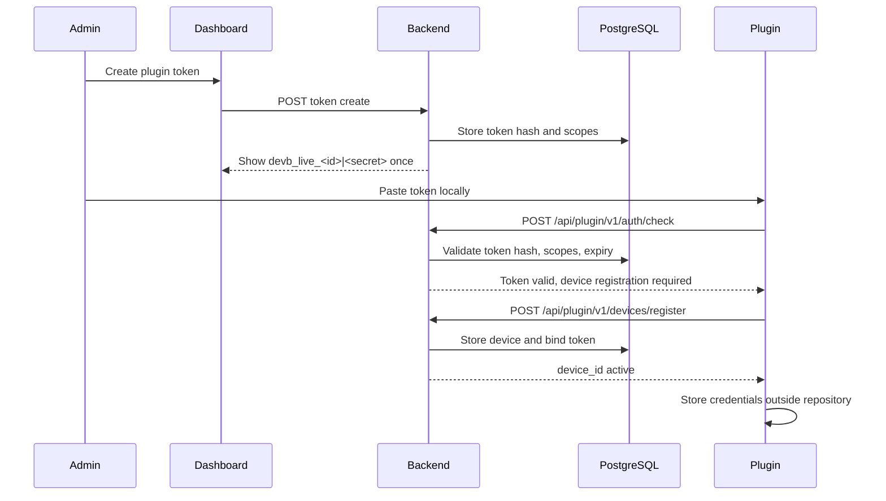
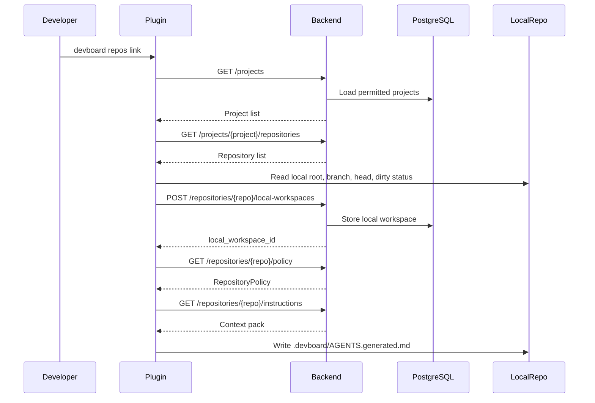
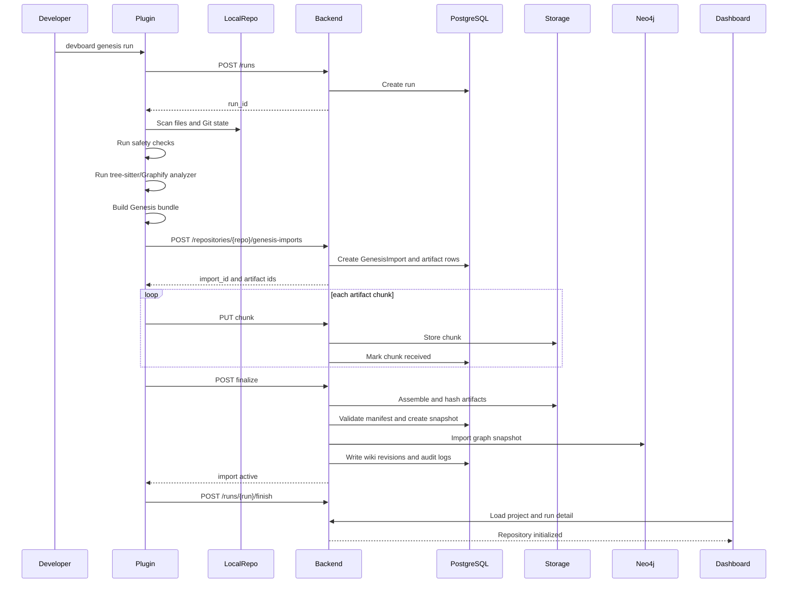
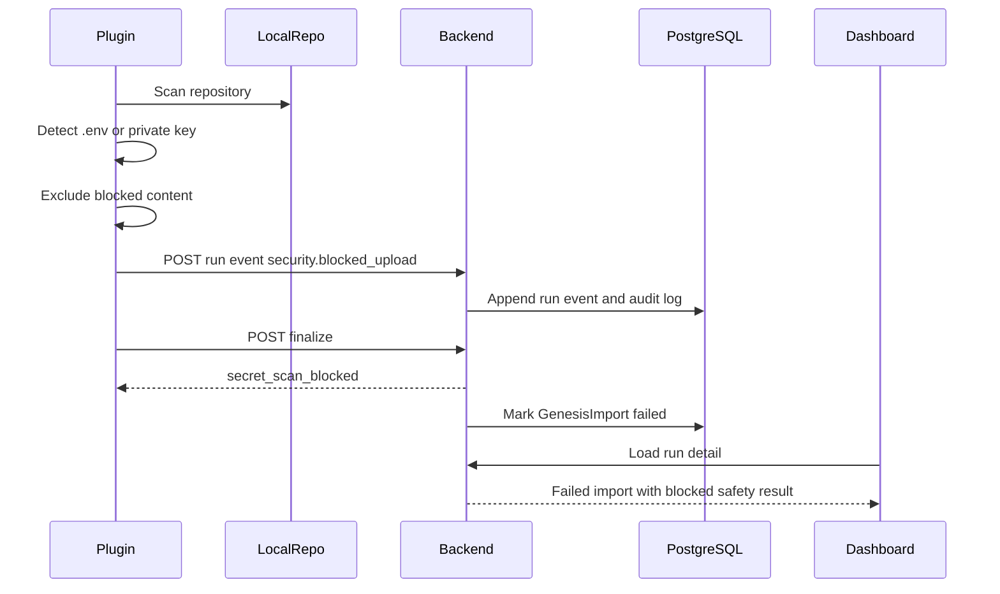
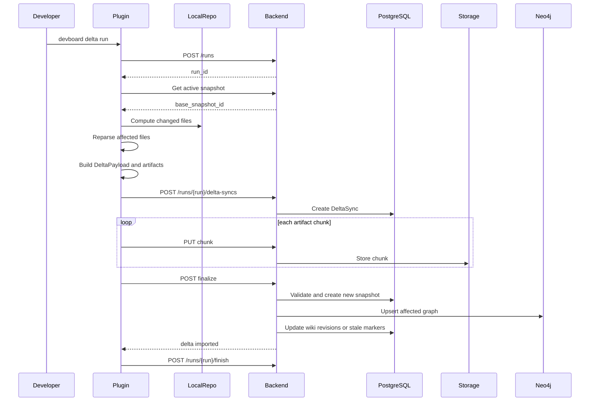
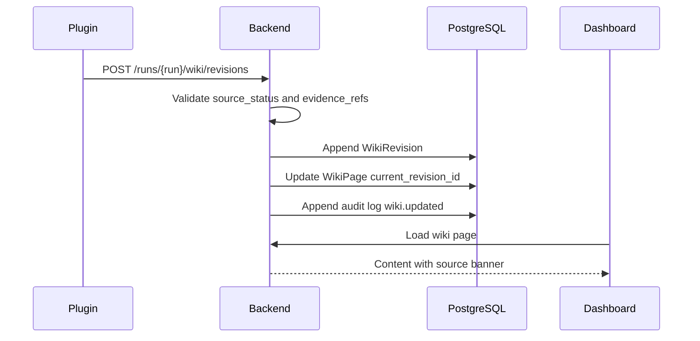
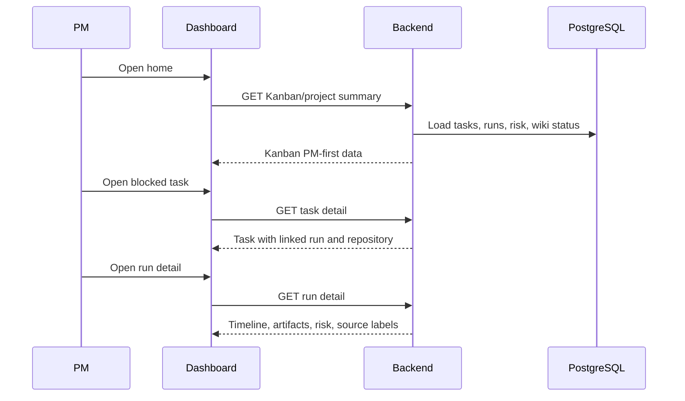
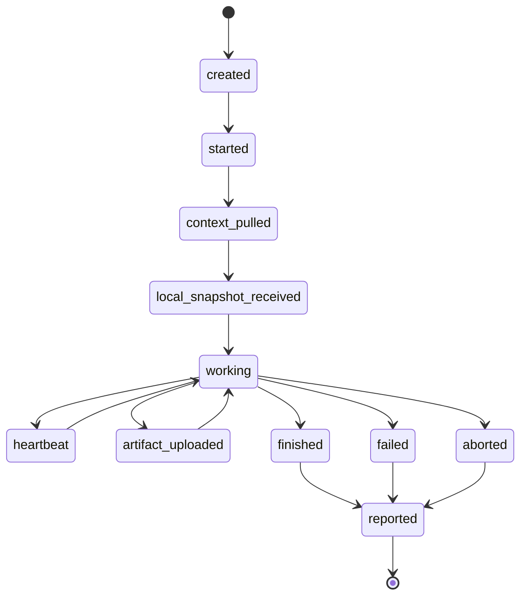
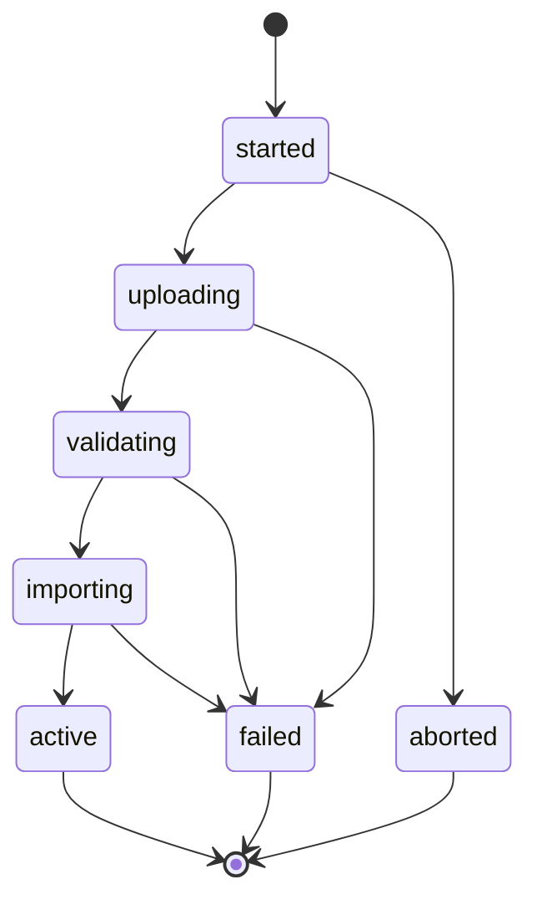
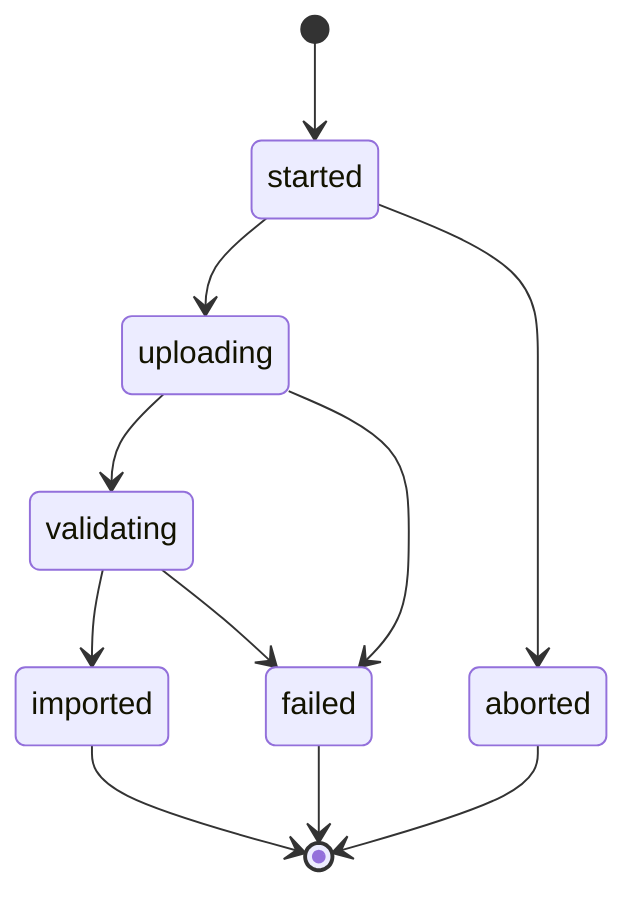

# AI DevBoard Runtime Sequences

This document defines V1 runtime sequences for plugin, backend, dashboard, artifact, graph, and wiki behavior.

## Actors

```text
Admin
PM
Developer
Codex/Claude/local model
Python plugin CLI/MCP
Laravel backend
PostgreSQL
Filesystem artifact storage
Neo4j
```

## Sequence 1 - Plugin Token Onboarding



Failure rules:

- invalid token returns `unauthorized`;
- revoked token returns `token_revoked`;
- missing scope returns `scope_missing`;
- token secret is never returned after creation.

## Sequence 2 - Repository Link and Context Pull



Failure rules:

- plugin must not write `.devboard/AGENTS.generated.md` before policy/context succeeds;
- generated context excludes tokens and secrets;
- local workspace state is not remote Git truth.

## Sequence 3 - Genesis Import Happy Path



Promotion rules:

- previous snapshot is superseded only after full validation and graph import;
- failed import preserves previous active state;
- dashboard labels the snapshot `local_plugin_snapshot`.

## Sequence 4 - Secret Block During Genesis



Rules:

- hard-blocked content is never uploaded;
- finalize fails when completeness is compromised;
- run detail shows blocked category and evidence without exposing secret content.

## Sequence 5 - Delta Sync



Rules:

- Delta Sync requires a base snapshot;
- historical snapshots are immutable;
- graph changes are linked to `delta_sync_id`;
- V1 does not mark branch pushed, PR opened, or merged.

## Sequence 6 - Direct Wiki Write From Plugin



Validation rules:

- `verified_from_code` requires evidence refs;
- missing evidence can be accepted only as `needs_verification`;
- old revisions remain queryable;
- conflicts are represented by source status, not by deleting content.

## Sequence 7 - Dashboard PM Flow



Permission rules:

- PM can edit tasks and business wiki;
- PM cannot create plugin tokens;
- PM cannot run code-write commands;
- PM can inspect artifacts only through permitted dashboard views.

## Run State Machine



Invalid transitions:

```text
finished -> working
failed -> working
aborted -> working
reported -> artifact_uploaded
```

## Genesis Import State Machine



Promotion to `active` requires:

```text
all required artifacts validated
snapshot created
Neo4j import completed
wiki revisions handled
audit log written
```

## Delta Sync State Machine



Delta failure leaves the previous active snapshot unchanged.

## Background Jobs

Required V1 jobs:

```text
ValidateArtifactChunks
FinalizeGenesisImport
ImportGenesisGraphToNeo4j
WriteGenesisWikiRevisions
FinalizeDeltaSync
ImportDeltaGraphToNeo4j
MarkStaleWikiPages
DetectMissedRunHeartbeat
```

Retry rules:

- chunk validation can retry safely;
- graph import can retry from validated artifacts;
- wiki revision writes can retry idempotently by run id and page slug;
- failed finalize must not promote partial state.

## Operational Acceptance

Runtime behavior is accepted when:

- every mutating plugin call creates a run event or audit log;
- failed uploads do not corrupt active snapshots;
- Neo4j can be rebuilt from validated artifacts;
- dashboard can explain why a run failed;
- source status is visible wherever technical knowledge appears;
- backend never requires direct source code access in V1.

